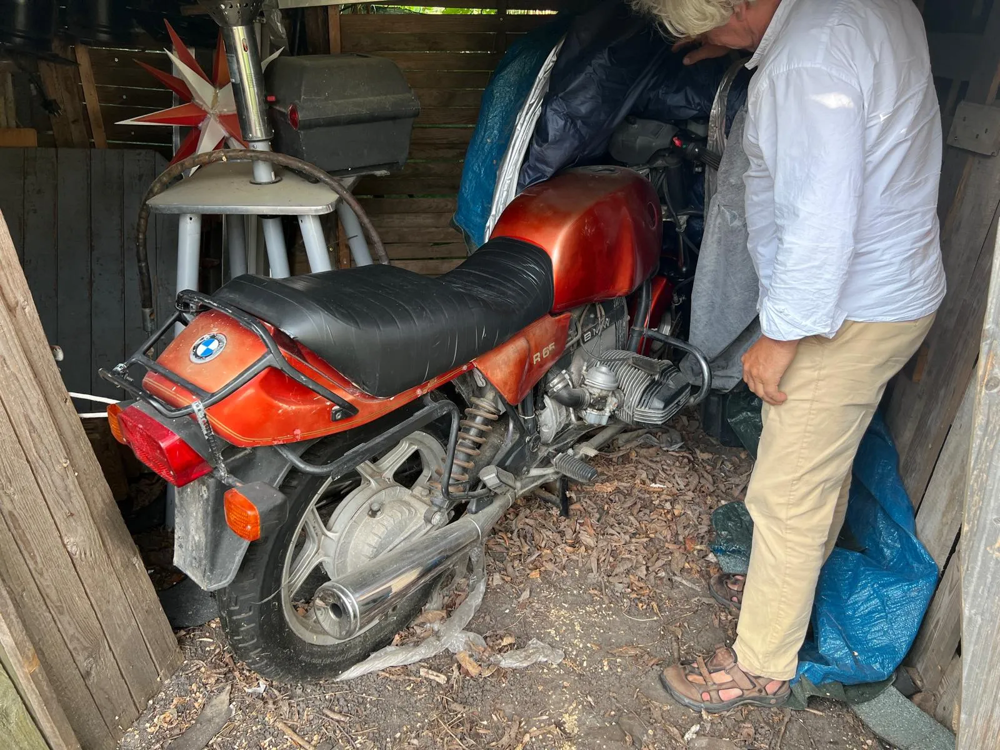
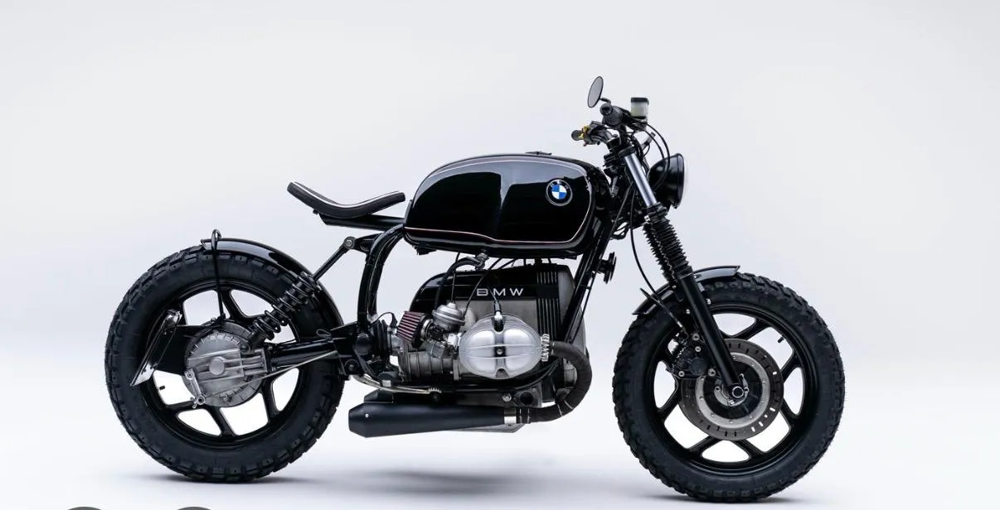
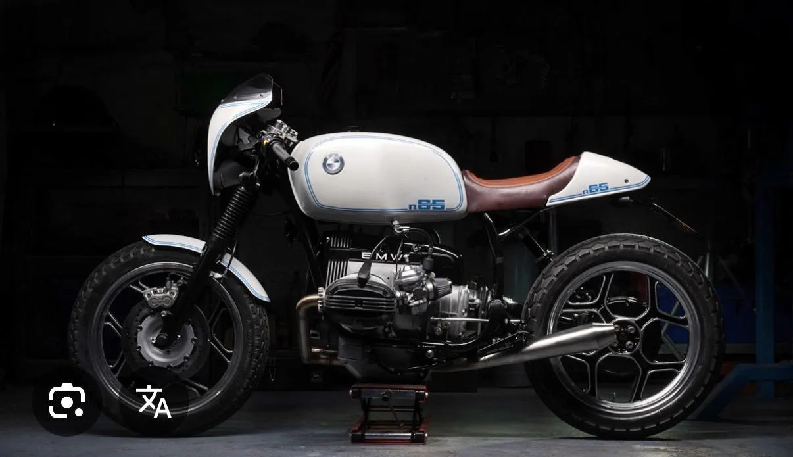
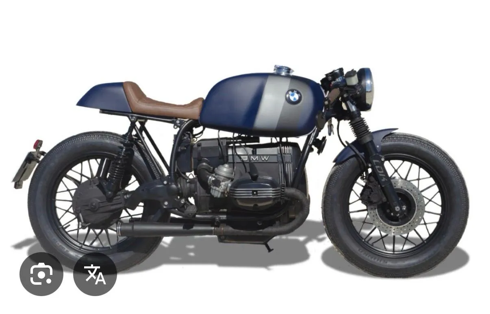
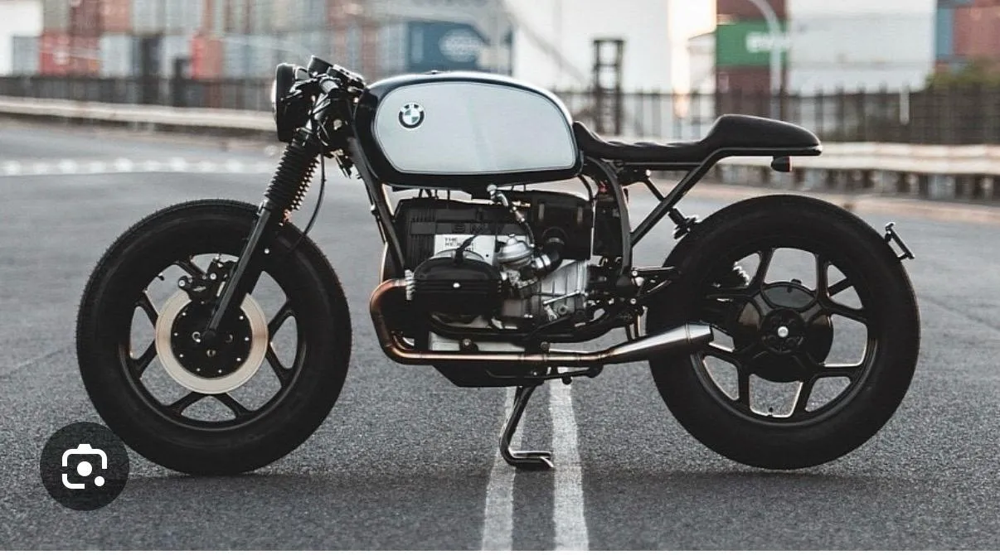
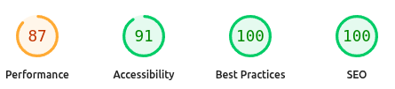
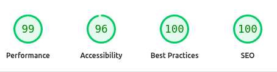

# Project: R65

From a rusted shed find to a track-tearing monster. This project documents the complete restoration and modification journey of a classic BMW R65 motorcycle.



This web application serves as a living document, a visual timeline, and a technical diary of the entire build process.

## ✨ Features

- **Interactive Timeline:** Follow the build process step-by-step, from the initial teardown to the final assembly.
- **High-Quality Gallery:** A visual feast of concept designs, work-in-progress shots, and final glamour shots.
- **Responsive Design:** A clean, modern interface that looks great on any device.
- **Dark Mode:** For comfortable late-night browsing.

## 🚀 Tech Stack

This project is built with a modern, performant, and scalable tech stack:

- **Framework:** [React](https://react.dev/) (with TypeScript)
- **Build Tool:** [Vite](https://vitejs.dev/)
- **Routing:** [TanStack Router](https://tanstack.com/router)
- **UI Components:** [shadcn/ui](https://ui.shadcn.com/) (built on Radix UI)
- **Styling:** [Tailwind CSS](https://tailwindcss.com/)
- **Linting:** [ESLint](https://eslint.org/)

Here's a glimpse of the concepts that inspired the build:

<p align="center">
  
  &nbsp;
  
</p>
<p align="center">
  
  &nbsp;
  
</p>

## 🛠️ Getting Started

To run this project locally, follow these steps:

1.  **Clone the repository:**

    ```bash
    git clone https://github.com/carcme/streetbike.git
    cd streetbike
    ```

2.  **Install dependencies:**
    This project uses `npm` as its package manager.

    ```bash
    npm install
    ```

3.  **Run the development server:**
    This will start the Vite development server, typically on `http://localhost:5173`.
    ```bash
    npm run dev
    ```

## 📂 Project Structure

The codebase is organized to be clean, modular, and easy to navigate.

```
/src
├── assets/         # Static assets like SVGs
├── components/     # Reusable UI components (mostly from shadcn/ui)
├── lib/            # Utility functions and shared logic
├── routes/         # Route-based components managed by TanStack Router
├── main.tsx        # The main application entry point
└── index.css       # Global styles and Tailwind CSS imports
```

---

This project is a labor of love, combining a passion for motorcycles with the art of web development.

#### Palette Generator

- **Palette Generator:** [Tweakcn](https://tweakcn.com/editor/theme)

- **Palette Preview:** [Add URL as Custom](https://tweakcn.com/editor/theme?p=custom)

---

#### PageSpeed Insights

###### <u>Mobile</u>

<center>



</center>

###### <u>Desktop</u>

<center>



</center>
